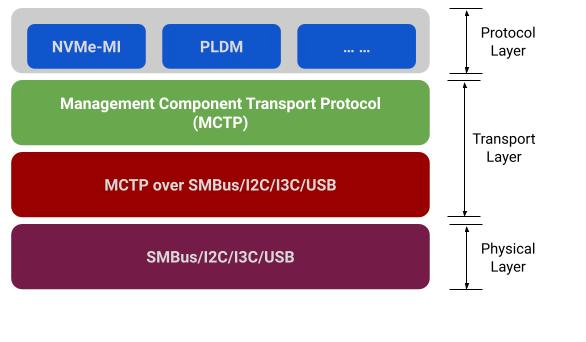

# License

## Open Web Foundation (OWF) CLA
Contributions to this Specification are made under the terms and conditions set forth in Modified OWF-CLA-1.0.2 (As of June 1, 2023) (“Contribution License”) by:  

- Google
- HPE
- Meta
- Samsung

Usage of this Specification is governed by the terms and conditions set forth in **Modified OWFa1.0.2 Final Specification Agreement (FSA) (As of June 1, 2023) (“Specification License”)**.  

You can review the applicable Specification License(s) referenced above by the contributors to this Specification on the OCP website at http://www.opencompute.org/participate/legal-documents/. For actual executed copies of either agreement, please contact OCP directly.

**Notes:**

The above license does not apply to the Appendix or Appendices. The information in the Appendix or Appendices is for reference only and non-normative in nature.

NOTWITHSTANDING THE FOREGOING LICENSES, THIS SPECIFICATION IS PROVIDED BY OCP "AS IS" AND OCP EXPRESSLY DISCLAIMS ANY WARRANTIES (EXPRESS, IMPLIED, OR OTHERWISE), INCLUDING IMPLIED WARRANTIES OF MERCHANTABILITY, NON-INFRINGEMENT, FITNESS FOR A PARTICULAR PURPOSE, OR TITLE, RELATED TO THE SPECIFICATION. NOTICE IS HEREBY GIVEN, THAT OTHER RIGHTS NOT GRANTED AS SET FORTH ABOVE, INCLUDING WITHOUT LIMITATION, RIGHTS OF THIRD PARTIES WHO DID NOT EXECUTE THE ABOVE LICENSES, MAY BE IMPLICATED BY THE IMPLEMENTATION OF OR COMPLIANCE WITH THIS SPECIFICATION. OCP IS NOT RESPONSIBLE FOR IDENTIFYING RIGHTS FOR WHICH A LICENSE MAY BE REQUIRED IN ORDER TO IMPLEMENT THIS SPECIFICATION. THE ENTIRE RISK AS TO IMPLEMENTING OR OTHERWISE USING THE SPECIFICATION IS ASSUMED BY YOU. IN NO EVENT WILL OCP BE LIABLE TO YOU FOR ANY MONETARY DAMAGES WITH RESPECT TO ANY CLAIMS RELATED TO, OR ARISING OUT OF YOUR USE OF THIS SPECIFICATION, INCLUDING BUT NOT LIMITED TO ANY LIABILITY FOR LOST PROFITS OR ANY CONSEQUENTIAL, INCIDENTAL, INDIRECT, SPECIAL OR PUNITIVE DAMAGES OF ANY CHARACTER FROM ANY CAUSES OF ACTION OF ANY KIND WITH RESPECT TO THIS SPECIFICATION, WHETHER BASED ON BREACH OF CONTRACT, TORT (INCLUDING NEGLIGENCE), OR OTHERWISE, AND EVEN IF OCP HAS BEEN ADVISED OF THE POSSIBILITY OF SUCH DAMAGE.  

# Acknowledgements

## Contributors

**Google** 
>chadyoshikawa@google.com  
>edtanous@google.com  

**HPE**  
>jeff.hilland@hpe.com  
>gregg.shick@hpe.com

**Meta**
>patrickw3@fb.com

**Samsung**  
>changho.c@samsung.com  
>kavin.lee@samsung.com  
>bj20.kim@samsung.com  
>mike.allison@samsung.com  

## Reviewers
The Contributors of this Specification would like to acknowledge the following companies for their feedback:  

Hewlett Packard Enterprise  
Google  
Samsung  
Dell  
Meta  

# Compliance with OCP Tenants
## Openness
The document proposes an ecosystem-enabling set of requirements for peripherals to
enable management compatibility between open systems. This allows interoperability between
various device classes and host systems.

## Efficiency
OEMs invest time to create specifications for industry Independent Hardware Vendors (IHVs)
which must be implemented in order to support proper management by the host. IHVs invest time working with multiple OEMs to implement those requirements.
The goal of the AMC specification is to standardize those various work streams into a single public OCP specification
where both OEM and IHV can more effectively promulgate these requirements.
Additionally, multi-vendor customer environments will benefit from the efficiencies achieved through increased device interoperability and the utilization of a common code base for system management.

## Impact
This document represents a single set of OCP device manageability requirements allowing for IHV
ease of development, time to market, and effective use of engineering resources. Device management ASICs could be developed allowing multiple IHVs to leverage a standardized auxiliary management controller component providing consistent management across device classes.

## Scale
Large scale deployments benefit from the standardization of management capability across multiple device classes, server and device vendors which this specification provides.  

Redfish, RDE and PLDM DMTF standards for management are utilized allowing for a common set of APIs and management tools regardless of hardware or software environment or size of server deployment.

## Sustainability
Between customers’ sustainability initiatives and demands to control energy consumption and costs, the ability to report, analyze and actuate server power usage data has become a key initiative.  

The creation of a truly interoperable telemetry environment will allow businesses to datacenters, no matter the size, to more effectively meet sustainability targets.
Auxiliary management controller thermal and power management capabilities can be utilized to enable this goal of minimizing power requirements and overall energy usage

# Change Log

Date | Version # | Author | Description
:- | :- | :- | :- |
7/5/2022 | 0.1 | Chad Yoshikawa | Filled in Title, Authors, Contributors and sections 1-3
10/1/2022 | 0.2 | Ed Tanous | Major reorganization. Rewrites to many sections
4/27/2023 | 0.3 | Ed Tanous | Removal of old text, formatting cleanups
9/15/2023 | 1.0 | Chad Yoshikawa | Used recent
2/12/2024 | 1.0 | Gregg Shick | Convert to markdown
4/15/2024 | 1.0 | John Leung | Format to work with DMTF Doc Publication tool
3/12/2025 | 1.2 | Gregg Shick | Add Table #'s   Cleanup SMC to AMC   Rewrite of Security section

# Overview
The Auxiliary Management Controller specification defines the management interface between a host server and hardware plug-ins.  For example: the host server has a baseboard management controller (BMC). The plug-in has an auxiliary management controller (AMC).  Hence, the manageament interface is the interface between the BMC and the AMC.  

Auxiliary Management Controllers are simple.
They manage a single thermal, power and security domain.
They do not manage other devices.

The host management controller and auxiliary management controller may be integrated onto the same board in the case of a tray and its SoC.  

The conformance of the AMC can be validated using software tools.
This enables independent hardware development and bring-up.
To provide validation, this document defines a compatibility test suite (CTS) to ensure conformance to specified functional requirements.  

The management interface additionally specifies SLOs  (Service Level Objective) for operations such as firmware update and power management operations.
These SLOs may impose constraints on the underlying hardware.
For example, timely firmware update may require i3c (vs. i2c) or higher-bandwidth management links.  

## Architectural Example  

This document includes all API definitions required for managing a peripheral device from an out-of-band baseboard management controller (BMC) in the most common configuration. 
While other configurations may exist that this specification fulfills, the above diagram is considered the baseline.
This document may reference elements of the baseline configuration as examples. Other configurations may exist.  

This document explicitly does not define any physical connectors, physical form factors, or specifications for non-AMC components.
Other specifications (such as the [Modular Hardware Management DC-SCM](https://www.opencompute.org/documents/ocp-dc-scm-spec-rev-1-0-pdf)) may define connector specifications that may be used in deployments.
For some examples, this specification may assume a PCIe 16X connector, and a single
socket server with BMC.

# Protocols

AMC devices *shall* implement DMTF DSP0236 ([Management Component Transport Protocol (MCTP) Base Specification](https://www.dmtf.org/dsp/DSP0236)).

## Physical bindings supported
Devices meeting this specification *shall* implement DMTF DSP0233 ([Management Component Transport Protocol (MCTP) I3C Transport Binding Specification](https://www.dmtf.org/dsp/DSP0233)) OR DSP0237 ([Management Component Transport Protocol (MCTP) SMBus/I2C Transport Binding Specification](https://www.dmtf.org/dsp/DSP0237)) OR DSP0238 ([Management Component Transport Protocol (MCTP) PCIe VDM Transport Binding Specification](https://www.dmtf.org/dsp/DSP0238)). Other physical bindings such as USB, that have MCTP bindings may be supported. Devices *shall* implement these protocols without requiring an on-board i2c mux in the protocol path.

  

## Protocol layers supported

### MCTP
* Compliance with MCTP Base Protocol Specification
     
     i. The device *shall* comply to all endpoint requirements as specified in this section
     
     ii. For SMBus (Binding) Protocol, the device *shall not* be the MCTP Bus Owner

     iii. The device *shall* support receiving an MCTP Set Endpoint ID command at any time (Standby or Main) power is applied. For example, the BMC firmware could be updated resulting in a BMC reset. The BMC initialization sequence will go out and dynamically discover devices and assign Endpoint IDs. While in most cases, the same Endpoint ID will be assigned, this is not guaranteed. The BMC will query the device to see if an Endpoint ID has been previously assigned and is not in conflict with any other assigned Endpoint.

* Compliance with Section “MCTP Message Types”
* Compliance with Section “MCTP Control Protocol”
* Compliance with Section “MCTP Control Messages”
* Support Section “MCTP Control Message Command Codes”, “MCTP Control Command
Numbers”
* Support Section “Prepare for Endpoint Discovery”
* Support Section “Endpoint Discovery”

MCTP Control Command ([DSP0236](https://www.dmtf.org/dsp/DSP0236)) | Implementation
:- | :- |
0x01 Set Endpoint ID | Required
0x02 Get Endpoint ID | Required
0x03 Get Endpoint UUID | Required
0x04 Get MCTP Version Support | Required
0x05 Get Message Type Support | Required
0x06=Get Vendor Defined Message Support | Required
0x0B=Prepare for Endpoint Discovery  | Required (PCIe VDM)
0x0C=Endpoint Discovery  | Required (PCIe VDM)
0x0D=Discovery Notify  | Required (PCIe VDM)

### PLDM

PLDM Messaging Control and Discovery Command Codes ([DSP0240](https://www.dmtf.org/dsp/DSP0240)) | Implementation
:- | :- |
0x01 SetTID | Required
0x02 GetTID | Required
0x03 GetPLDMVersion | Required
0x04 GetPLDMTypes | Required
0x05 GetPLDMCommands  | Required
0x06 SelectPLDMVersion  | Required
0x07 NegotiateTransferParameters | Required for PLDM FW Multipart
0x08 MultipartSend | Required
0x09 MultipartReceive | Required 

### Redfish Device Enablement

The AMC support requirements are:

- Devices *shall* conform to DSP0218 ([Platform Level Data Model (PLDM) for Redfish Device Enablement](https://www.dmtf.org/dsp/DSP0218))  
- Devices *shall* support 1 support one RDE tree operartion.
- Devices *should* support a minimum of 4 concurrent RDE tree operations.  
- Devices *should* be capable of returning the requested portions of the Redfish tree in less than 2 seconds.

Table specific the RDE command requirements

RDE Command | &nbsp; | Implementation
:- | :- | :- |
0x01 NegotiateRedfishParameters | &nbsp; | Required
&nbsp;  | DeviceCapabilitiesFlags | Support atomic resource read to enable consistent reads
&nbsp; | DeviceFeatureSupport | Head and replace optional. Read mandatory. Other features are optional for inventory-only devices and mandatory for full support.
&nbsp; | DeviceConfigurationSignature | Required as documented
0x02 NegotiateMediumParameters | &nbsp; | Required
0x03 GetSchemaDictionary | &nbsp; | Required
0x04 GetSchemaURI | &nbsp; | Required
0x05 GetResourceETag | &nbsp; | Required
0x08 GetRegistryCount | &nbsp; | Required for full event support
0x09 GetRegistryDetails | &nbsp; | Required for full event support
0x0A SelectRegistryVersion | &nbsp; | Required for full event support
0x0B GetMessageRegistry | &nbsp; | Required for full event support
0x10 RDEOperationInit | &nbsp; | Required for full event support
&nbsp; | 0=OPERATION_HEAD | Required
&nbsp; | 1=OPERATION_READ | Required
&nbsp; | 2=OPERATION_CREATE | Conditional - Required for write support
&nbsp; | 3=OPERATION_DELETE | Conditional - Required for write supportired
&nbsp; | 4=OPERATION_UPDATE | Conditional - Required for write support
&nbsp; | 6=OPRERATION_ACTION | Conditional - Required for write support
0x11 SupplyCustomRequestParameters | &nbsp; | Required
0x12 RetrieveCustomResponseParameters | &nbsp; | Required
0x13 RDEOperationComplete | &nbsp; | Required
0x14 RDEOperationStatus | &nbsp; | Required
0x16 RDEOperationEnumerate | &nbsp; | Required
0x30 RDEMultipartSend | &nbsp; | Required for write support
0x31 RDEMultipartReceive | &nbsp; | Required

## Device Identification

Devices *shall* expose an interface to a Platform Management FRU Information Storage Definition-compatible API.
The document does not specify where this FRU payload must be physically implemented within the card. Implementations may choose to implement in a physical eeprom device, or a virtual eeprom device. Care should be taken in platform design to ensure that the eeprom is available in the required power states consistent with the needs of the baseline server, but this specification does not specify which power states it will be available in.

The FRU information *shall* contain the following fields. Other fields may be populated.

* Manufacturer Name
* Product Name
* Product Serial Number

## Device Classes

The following device classes *shall* be supported: Accelerator, NIC, DPU (SmartNIC), Storage Tray, Memory (CXL).

# API Surface

Table XX specifies the required support for various device classes. "R" signifies that support is required. "C" signifies that support is required if the feature exists.
For example, an Accelerator device may not have a Fan and thus Fan Control is conditional.

Subsystem | Thermal | Inventory | Software Management | Fan Control | Security | Power Management
:- | :-: | :-: | :-: | :-: | :-: | :-:
*Accelerator* | R | R | R | C | R | C
*NICs* | C | R | R | C | R | C
*DPUs* | R | R | R | C | R | C
*Storage Tray* | C | R | R | C | R | C
*Memory (CXL)* | R | R | C | C | R | C

## Thermal management subsystem

The thermal management subsystem is intended to allow AMC devices to be managed by a closed loop thermal system. Implementation the thermal management subsystem requires support for the following Redfish resources and properties.

**Sensor**

The SensorCollection resource *shall* implement one or more sensor resources representing the thermal temperature of the device. 

The sensor *shall* have the following properties supported.

* **ReadingUnits** *shall* be presented and implement as "Cel"
* **ReadingType** *shall* be present and implemented as “Temperature”
* Threshold properties of **UpperCritical**, **UpperFatal**, **LowerCritical**, and **LowerFatal** *shall* be implemented and represent the design limits of the AMC device in question. Devices with unlimited thermal design limits *shall* omit these properties.

If the AMC device possess fans, the AMC SensorCollection shall implement a Sensor with the following properties:

* **ReadingUnits** *shall* be present and implemented as “{rev}/min”
* **ReadingType** *shall* be present and implemented as “Rotational”

Devices implementing a single replaceable component may implement PLDM type 2 for sensor readings.

**PLDM Type 2 Sensor Requirements**

Table XX specifies the support requirement for the PLDM for Platform Monitoring and Control ([DSP0248](https://www.dmtf.org/dsp/DSP0248)

Command Codes | &nbsp; | Implementation
:- | :- | :- |
Terminus Command | &nbsp; | &nbsp;
&nbsp; | 0x04 SetEventReceiver | Required for RDE Alert
&nbsp; | 0x05 GetEventReceiver | Required for RDE Alert
&nbsp; | 0x0B PollForPlatformEventMessage | Required for RDE Alert
&nbsp; | 0x0C EventMessageSupported | Required
&nbsp; | 0x0D EventMessageBufferSize | Required for RDE Alert if MSG size > 256 bytes
Numeric Sensor Commands | &nbsp; | &nbsp;
&nbsp; | 0x11 GetSensorReading | Required
&nbsp; | 0x12 GenSensorThreshold | Required
&nbsp; | 0x15 GetSensorHysteresis | Required
State Sensor Commands | &nbsp; | &nbsp;
&nbsp; | 0x21 GetStateSensorReadings | Required
PDR Repository Commands | &nbsp; | &nbsp;
&nbsp; | 0x50 GetPDRRepositoryInfo | Required
&nbsp; | 0x51 GetPDR | Required
&nbsp; | 0x53 GetPDRRepositorySignature | Required for RDE
PLDM Event Types | &nbsp; | &nbsp;
&nbsp; | 0x02 redfishTaskExecutedEvent | Required if implementation cannot complete commands quickly enough to avoid spawning RDE tasks
&nbsp; | 0x03 redfishMessageEvent | Required for redfish eventing
&nbsp; | 0x51 GetPDR | Required for RDE
PDR Type Values | &nbsp; | &nbsp;
&nbsp; | 2 = Numeric Sensor PDR | Required
&nbsp; | 4= State Sensor PDR | Required
&nbsp; | 22 = Redfish Resource PDR | Required for RDE

Devices implementing multiple replaceable components shall implement ThermalSubsystem over RDE.

**ThermalSubsystem**

An AMC Redfish ThermalSubsystem *shall* be implemented, with the following properties:

* *Fans*: With Fan resources representing the fans physically present on this device.
* Fan resources *shall* contain the following properties
   - *SpeedPercent*
 
## Inventory Management

Requirements within this section are intended to allow inventory management and control of a given device. AMC devices *shall* implement:

**ChassisCollection**

The ChassisCollection in the device *shall* contain one or more Chassis Resources representing the device in question. Chassis resources shall implement the following properties:

* Model: The value of this property *shall* match the “Product Name” field present in the FRU identification from section 5.3
* Manufacturer:The value of this property *shall* match the “Manufacturer Name” field present in the FRU identification from section 5.3
* SerialNumber: The value of this property *shall* match the “Serial Number” field present in the FRU identification from section 5.3

AMC devices *may* implement more than one Chassis resource, for representing physical subsystems within the device. Within the AMC chassis collection, there *shall* be only one Chassis instance (referred to further as the “root”) that does not possess a ContainedBy attribute, and is intended to represent the overall containment of the device. All other devices *shall* have a ContainedBy Link, traceable to the root device. Root devices *shall* implement a “Contains” property representing the devices containment

## Firmware and Software Update

AMC devices may have one or multiple updateable firmware or software components.

### Single Update

AMC devices with a single updateable firmware or software component *should* implement PLDM for Firmware Update (type 5).

PLDM for Firmware Update | Implementation
:-| :-|
0x01 QueryDeviceIdentifiers | Required
0x02 GetFirmwareParameters | Required
0x03 QueryDownstreamDevices | Required
0x04 QueryDowstreamIdentifiers | Required
0x05 GetDownstreamFirmwareParameters  | Required
0x10 RequestUpdate | Required
0x13 PassComponentTable | Required
0x14 UpdateComponent | Required
0x15 RequestFirmwareData | Required
0x16 TransferComplete | Required
0x17 VerifyComplete | Required
0x18 ApplyComplete | Required
0x1A ActivateFirmware| Required
0x1B GetStatus  | Required
0x1B GetStatus | Required
0x1C CancelUpdateComponent | Required
0x1D CancelUpdate | Required
0x20 RequestDownstreamDeviceUpdate | Required

### Multiple Update

AMC devices with multiple updateable firmware or software components *shall* support an UpdateService resource. The UpdateService resource *shall* implement one or more of FirmwareInventory, or SoftwareInventory collections.
Collections shall contain at least one member of type SoftwareInventory, implementing the following properties

* **Version**: The software version running on the AMC device.
* **Updateable**: Whether or not the device supports update. For AMC devices, this shall be set to True.
* **SoftwareID**: Unique identifier for this devices firmware type.
* **AdditionalVersions**: Devices that fit the Redfish descriptions in these properties *shall* implement AdditionalVersions, with the appropriate subproperties. Devices that do not fit the description *shall* omit the AdditionalVersions Property.

AMC devices with a single updateable firmware or software component *should* implement PLDM for Firmware Update (type 5).

PLDM for Firmware Update | Implementation
:-| :-|
0x01 QueryDeviceIdentifiers | Required
0x02 GetFirmwareParameters | Required
0x03 QueryDownstreamDevices | Required
0x04 QueryDowstreamIdentifiers | Required
0x05 GetDownstreamFirmwareParameters  | Required
0x10 RequestUpdate | Required
0x13 PassComponentTable | Required
0x14 UpdateComponent | Required
0x15 RequestFirmwareData | Required
0x16 TransferComplete | Required
0x17 VerifyComplete | Required
0x18 ApplyComplete | Required
0x1A ActivateFirmware| Required
0x1B GetStatus  | Required
0x1B GetStatus | Required
0x1C CancelUpdateComponent | Required
0x1D CancelUpdate | Required
0x20 RequestDownstreamDeviceUpdate | Required

AMC devices *shall* be updated in 1 minute or less, measured in the time that the device is unavailable, and 5 minutes or less from the time the update is requested, including all data transfers to the device.

## Fan Control  

AMC devices containing fans shall implement control and monitoring of those fans through the RDE interface. Devices shall support the Redfish Control schema for fan control within a system. AMC devices may run internal control loops in addition to the control loops presented on the RDE interface.

## Power Management  

If the AMC device supports reset, the Redfish Chassis.Reset action *shall* be supported,   

If an AMC device provides power metrics, the EnvironmentMetric resource and Sensor collection resource *shall* implement the following properties where supported:

- EnergykWh or EnergyJoules
- PowerWatts
- PowerLimitWatts
- ResetMetrics
- AverageReading
- AveragingInterval

## Security
Requirements within this section are intended to define security and SPDM requirements for AMC controllers applicable across supported device classes. 
### SPDM
AMC *shall* comply with the following SPDM requirements:

- Support SPDM 1.2.2 [DSP0274] or later while maintaining backward compatibility with SPDM 1.1.  Signature endianness *shall* follow SPDM 1.2.2 or later.
- Comply with the revised PCI-SIG Component Measurement and Authentication (CMA-SPDM) ECN that was published on September 20, 2023.
- Comply with the Secured Messages using SPDM over MCTP Binding Specification, Version 1.1.1 or later.
- Comply with the Secured Messages using SPDM Specification, Version 1.1.1 or later. Mutual authentication is not required.
- Comply with the Security Protocol and Data Model (SPDM) over MCTP Binding Specification, Version 1.0.2 or later.
- Must not drop the response if RESPOND_IF_READY is not received within WTMax amount of time after sending an ERROR message with an ErrorCode equal to ResponseNotReady.
- Be ready to respond to SPDM requests within a maximum of 2 second after main power is applied.
- SPDM MCTP interpacket delay shall be less than 40 ms.
- Support a DataTransferSize of at least 4 KiB.
- If not ready to accept a new request message, the AMC shall respond with an ERROR response message with an ErrorCode of Busy (3h) (i.e., the device shall not silently discard the request message).
- If a request is received out of order, the AMC shall respond with an ERROR response message with an ErrorCode of RequestResynch (i.e., 43h) for that request and for all subsequent requests until a GET_VERSION command is received and processed.  The device shall not silently discard requests due to an out of order request.

Table 8 specifies ACM response code requirements for SPDM.
**Note:** Sync with the OCP Security Group around these requirements is required.  

**Table 8**
SPDM Repsonse | Note | Implementation |
:-| :-| :-|
0x01 DIGESTS |  | Required 
0x02 CERTIFICATE | |Required 
0x03 CHALLENGE_AUTH |0x0 - No measurement summary hash requested  0x1 - TCB measurements only  0xFF - All measurements |Required 
0x04 VERSION | |Required 
0x05 CHUNK_SEND_ACK | |Optional 
0x06 CHUNK_RESPONSE | |Optional 
0x60 MEASUREMENTS |MEAS_CAP=10b  DMTFSpecMeasurementValueType  - [00h] Immutable Rom  - [01h] Mutable FW |Required 
0x61 CAPABILITIES |CERT_CAP  CHAL_CAP  MEAS_CAP |Required 
0x63 ALGORITHMS |BaseAsymAlgo  - [Bit 2] TPM_ALG_RSASSA_3072 [CMA, CNSA,OCP] (Allowed)  - [Bit 4) TPM_ALG_ECDSA_ECC_NIST_P256[CMA] (Allowed)  - [Bit 7] TPM_ALG_ECDSA_ECC_NIST_P384[CMA, CNSA, OCP] (Preferred)   BaseHashAlgo  - [Bit 0] TPM_ALG_SHA_256 [CMA] (Allowed)  - [Bit 1] TPM_ALG_SHA_384 [CMA, CNSA, OCP] (Preferred)   MeasurementHashAlgo  - [Bit 1] TPM_ALG_SHA_256 [CMA] (Allowed)  - [Bit 2] TPM_ALG_SHA_384 [CMA, CNSA, OCP] (Preferred) |Required 
0x64 KEY_EXCHANGE_RSP | |Required 
0x65 FINISH_RSP | |Required 
0x66 PSK_EXCHANGE_RSP | |Optional 
0x67 PSK_FINISH_RSP | |Optional 
0x68 HEARTBEAT_ACK | |Optional 
0x6C END_SESSION_ACK | |Required 
0x6D CSR | |Recommended 
0x6E SET_CERTIFICATE_RSP | |Recommended 
0x7E VENDOR_DEFINED_RESPONSE | |Optional 
0x7F ERROR | |Required 

### SPDM Certificate Requirements
- The Root CA Trusted Certificate Authority shall be the device vendor and shall be the same across all device models developed by the device vendor.
- Self-signed certificates are prohibited.
- The AMC shall support the AliasCert or DeviceCert model in slot 0.
  
### SPDM Firmware Measurements
- The AMC shall be able to generate signed measurements (i.e., MEAS_CAP field shall be set to 10b) and shall support the following Measurement block types:
  
**Table 9**  
| DMTFSpecMeasurementValueType             | Requirement |
|:------------------------------------ |:-------------- |
| [7] - 0b: Digest, 1b: Raw Bit Stream          | Digest Required       |
| [6:0] = 00h: immutable ROM           | Recommended       |
| [6:0] = 01h: mutable firmware          | Required       |
| [6:0] = 02h: hardware configuration, such as straps, debug modes       | Recommended       |
| [6:0] = 03h: firmware configuration (e.g., configurable firmware policy) | Recommended       |
| [6:0] = 04h: Measurement manifest                   | Required       |
| [6:0] = 05h: Structured representation of debug and device mode              | Optional       |
| [6:0] = 06h: Mutable firmware’s version number                 | Optional       |
| 6:0] = 07h: Mutable firmware’s security version number, which should be formatted as an 8-byte unsigned integer             | Optional       |

  
- The AMC shall always return measurements of the most recently activated firmware and current configuration without requiring a power cycle or any type of PCIe reset. Measurements of the activated firmware image are acceptable.
- The AMC shall report the same measurements blocks and values for all devices in a product family (e.g., devices with the same model but different capacity points, endurance, or form factor).
- The AMC shall provide a reference integrity measurement manifest (RIM) for the firmware modules and configuration settings for components using the CoRIM schema as defined by IETF (refer to the latest version of draft-ietf-rats-corim - Concise Reference Integrity Manifest or the RFC (if any) published from that Internet-Draft).
- The reference measurements in the CoRIM schema may be expressed using the CoMID tags and/or the CoSWID tags. If the CoRIM has reference measurements from sub-components from different manufacturers, then the reference values of the sub-components shall be captured in CoSWID tags with their individual signatures.
- The RIM shall apply to all devices in a product family (e.g., devices with the same model but different capacity points, endurance, or form factor). The RIM shall not include any instance specific information (e.g., any device specific identifiers such as Serial Number, UUID, etc.).
- The RIM shall be signed by the device manufacturer using the COSE schema (refer to RFC 8152 - CBOR Object Signing and Encryption (COSE) (ietf.org)). The device manufacturer shall use an approved digital signature algorithm (see SEC-48).
- The device manufacturer shall provide the customer with a digital certificate with the public key that is able to be used to verify the RIM signatures. This digital certificate shall validate (e.g., via direct signature or certificate chain) to the Root CA Trusted Certificate Authority
- The RIM shall contain the hash values of each firmware module using an approved hashing algorithm (see SEC-48). ASCII text string values in the RIMs are acceptable if the string length is less than 128 bytes and the string is descriptive (e.g., a module identifier string, a product identifier string, or firmware revision string).

# Glossary of Terms

This section provides definitions for terms used in this document.  

**Server**. Machine hardware that contains a Auxiliary plug-in. Auxiliary containers are typically Servers but are not required to be so. So we use the more general term Host for a Auxiliary
container.  

**Host**. A generalization of a Auxiliary container that includes Servers (for PCIe Plug-In Auxiliarys) and motherboards (for SoC Auxiliarys). A Host is managed by a logical Host Management Controller (HMC).  

**AMC Devices**. A dependent group of hardware that is managed by a logical Auxiliary
Management Controller (AMC). AMC Devices typically are smaller than their Host, are terminal points in the management graph, and contain a single power & thermal domain.  

**AMC**. Auxiliary Management Controller provides a management API to the AMC device.
AMCs may be backed by one or more discrete hardware components.
AMC is typically a low-cost microcontroller running a RTOS with no external DRAM.   

**Terminal Hardware**. Hardware that is an endpoint in the management graph. In other
words, terminal hardware does not itself manage other hardware. AMC devices are terminal hardware. 

# References

- DMTF DSP0218 - [Platform Level Data Model (PLDM) for Redfish Device Enablement](https://www.dmtf.org/dsp/DSP0218)
- DMTF DSP0233 - [Management Component Transport Protocol (MCTP) I3C Transport Binding Specification](https://www.dmtf.org/dsp/DSP0233)
- DMTF DSP0236 - [Management Component Transport Protocol (MCTP) Base Specification](https://www.dmtf.org/dsp/DSP0236)
- DMTF DSP0237 - [Management Component Transport Protocol (MCTP) SMBus/I2C Transport Binding Specification](https://www.dmtf.org/dsp/DSP0237)
- DMTF DSP0238 - [Management Component Transport Protocol (MCTP) PCIe VDM Transport Binding Specification](https://www.dmtf.org/dsp/DSP0238)
- DMTF DSP0240 - [Platform Level Data Model (PLDM) Base Specification](https://www.dmtf.org/dsp/DSP0240)
- DMTF DSP0241 - [Platform Level Data Model (PLDM) Over MCTP Binding Specification](https://www.dmtf.org/dsp/DSP0241)
- DMTF DSP0248 - [Platform Level Data Model (PLDM) for Platform Monitoring and Control Specification](https://www.dmtf.org/dsp/DSP0248)
- DMTF DSP0267 - [Platform Level Data Model (PLDM) for Firmware Update Specification](https://www.dmtf.org/dsp/DSP0267)
- DMTF DSP0274 - [Security Protocol and Data Model (SPDM) Specification](https://www.dmtf.org/dsp/DSP0274)
  
